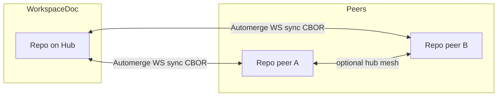

# Multi-replica sync and issue #26 (test-first full plan)

## Test-first delivery (non-negotiable)

- **UC1–UC3 specs exist before the native WebSocket implementation is considered “done”.** The first mergeable slice is allowed to add **skipped** or **gaps-only** tests only if `package.json` / the test file header documents that policy explicitly.
- **No closing #26 without green UC1–UC3** (in whichever suite they live after the policy choice) **plus** aligned GAP 1 for the native wire.
- **Product code follows the tests:** server `WebSocketServerAdapter` path, `sharePolicy`, and docs updates are in service of making **the same three `it(...)` blocks** pass—not the other way around.

## Context (repo facts)

- **`AutomergeStore`** (`lib/automerge-store.js`) already uses `@automerge/automerge-repo` with **NodeFS storage**, but **`sharePolicy: async () => false`** — so **no remote sync** is permitted today.
- **`automerge-sync-server.js`** exposes a **custom JSON** WebSocket (`document-state`, `document-update`, `document-change`). The fitness suite documents that this is **not** the Automerge binary/CBOR protocol (`test/fitness-gaps.test.js` GAP 1).
- **`@automerge/automerge-repo-network-websocket`** ships **`WebSocketServerAdapter`** and **`WebSocketClientAdapter`** with a documented wire protocol (join/peer handshake then sync phase) — see `node_modules/@automerge/automerge-repo-network-websocket/README.md`.
- **Version split:** root uses **`@automerge/automerge-repo` ^2.5.1**; `ui-prototype` pins **^1.1.x** — any browser-native Repo sync must **align major versions** or stay HTTP-only until upgraded.
- **Traceability:** GAP 1 is the existing “native wire” probe; **UC1–UC3** (below) are the **authoritative** functional requirements for #26 once native sync lands.

## Test-first acceptance (use cases)

Work **starts here**: add integration tests that encode the three scenarios below. They may live in `test/` (default `npm test` for stable cases) or under a `GAP:` / dedicated sync suite if they are expected to fail until native WS lands—**but the specs and helpers exist before production code changes**.

Definitions for tests:

- **Actor** = logical author (`agent` string on mutations, or distinct test identities).
- **Replica** = one **`Repo`** (+ storage: temp `NodeFSStorageAdapter` dir or in-memory where supported) holding a **copy** of the workspace document, connected by **`WebSocketClientAdapter`** to a hub (or hub-to-hub for UC3 federation stretch).

### UC1 — Two actors, same replica

**Intent:** Concurrent edits against **one** authoritative store process (one hub’s `Repo`) still merge **via Automerge**, not only via HTTP serialization.

**Test shape (preferred):** Two peer `Repo` instances both connected with native sync to **the same** `AutomergeSyncServer`; actor A changes field X on task T, actor B changes field Y on task T **without** a single serialized HTTP ordering between them (true concurrent `change` after sync or parallel peer writes). Assert final doc contains **both** X and Y.

**Contrast (document in test comment):** Two actors only using **HTTP PATCH** against one server does **not** prove UC1 for CRDT merge—that path remains **LWW at the HTTP boundary** until each actor holds a `Repo` replica.

**Flake guard:** use deterministic awaits (e.g. both handles `isReady`, sync settle helper with bounded timeout) rather than raw `setTimeout` where possible.

### UC2 — One actor, two replicas

**Intent:** Same actor (same `agent` id) works from two stores (e.g. two devices); both hold replicas of the same document URL; edits on replica 1 appear on replica 2 after sync.

**Test shape:** One hub; `Repo` R1 and `Repo` R2 (separate storage roots) both sync the same `documentUrl`; R1 applies change; assert R2’s materialized doc matches after sync flush / round-trip.

### UC3 — Two actors, each on their own replica, over the network

**Intent:** **Cross-network coordination**—the scenario closest to multi-site Mission Control: Actor A on replica A, Actor B on replica B, connected through **at least one** network hop (typically both to the same hub, or A→hubA↔hubB←B for federation).

**Test shape (minimal):** Two peer Repos, same hub, **partition** (disconnect sockets or delay sync), A edits on replica A, B edits on replica B (disjoint fields first, then optional same-field case per product preference A), reconnect, assert **automatic convergence** and no silent loss of structured data.

**Test shape (federation stretch):** Two `AutomergeSyncServer` instances with hub B’s `Repo` federated to hub A (client adapter); UC3 still passes through the mesh—mark as follow-up if UC3-minimal ships first.

## Product requirements (locked from discussion)

| Topic | Decision |
|--------|----------|
| Availability | **No meaningful downtime** for authoring: **multi-writer** during partitions / partial failure is in scope philosophically. |
| Merge preference | **Automatic convergence** for ordinary collaborative fields; **history/audit** should make outcomes explainable (“nothing silently vanishes”). |
| Daemon “delivered” | **Per-replica local ledger** (idempotency by stable mention id); **not** authoritative shared merge state. |
| Shared doc | Keeps **@mention as a shared event** + **team-visible** mention fields; harness-level attention is **out of scope** (lives with harness). |
| Per-operator read state | **Phase 2 proposal:** separate **operator satellite Automerge docs**; phase 1 may allow **temporary** `readState[operatorId]` in the workspace doc only as **documented debt**. |

## Target architecture (phase 1)

**Use-case mapping (tests should mirror this):**

- **UC1 + UC3 (minimal):** `PeerA` and `PeerB` are two actor-attributed peer Repos; `RepoHub` is the server’s `Repo`. Both peers use the **native** WS path to the same hub.
- **UC2:** Same diagram, but **both** peers mutate with the **same** `agent` / actor identity; assertions are symmetric replication, not two distinct actors.
- **UC3 (federation stretch):** second hub not in diagram—`PeerA` attaches to `HubA`, `PeerB` to `HubB`, with **hub-to-hub** native sync between `Repo` instances; same partition/reconnect story.

- **Single logical workspace** = one Automerge **document URL** (already persisted via `document-url` / `.mission-control-url`).
- **Hub** runs a `Repo` with **filesystem storage** + **`WebSocketServerAdapter`** so **native sync** works for any peer allowed by `sharePolicy`.
- **Multi-hub active/active:** each hub runs its own `Repo` on **replicated storage** *or* hubs connect as **websocket clients to each other** (federation). Pick one concrete strategy in implementation (see risks).

## Phase 1 — Implementation plan (executable)

**Order of work:** (0) **UC1–UC3 tests + helpers** (failing or skipped until green). (1)–(2) Server + `sharePolicy`. (3) Make UC tests pass; keep GAP 1 aligned. (4)–(7) as below.

### 0) Test harness and specs (first PR slice)

- Extend **`support/resources.js`** (or add `test/sync-use-cases.test.js`): helpers to **start server**, mint **WS tickets**, build **`WebSocketClientAdapter`** URLs for the **native** path, create **ephemeral `Repo`** with temp storage, `find(documentUrl)`, wait for `isReady`, **partition** helpers (close adapter / block until reconnect).
- Implement **UC1, UC2, UC3** as separate `it(...)` blocks with names that include `UC1`/`UC2`/`UC3` for grep and issue linking.
- Until native sync exists: either **`it.skip`** with pointer to #26 or **`npm run test:gaps`-only** suite—pick one policy and document in `package.json` / test header so CI stays honest.

### 1) Server: native Automerge WebSocket endpoint

- **Problem:** Today one WS port speaks **only JSON**. Automerge peers need the **binary** join/sync loop.
- **Approach (pick one and implement consistently):**
  - **1a) Path-based:** e.g. `GET /mc-ws/automerge` (or `/automerge-repo`) for **native** sync; keep existing JSON protocol on another path **temporarily** for `ui-prototype` until migrated.
  - **1b) Subprotocol / first-byte routing:** more fragile; avoid unless you have strong reasons.
- **Code touchpoints:** `automerge-sync-server.js` — after existing **ticket** auth on upgrade, branch by **URL path** to either:
  - **Legacy JSON handler** (current behavior), or
  - **`WebSocketServerAdapter.receiveMessage`** from `@automerge/automerge-repo-network-websocket` bound to the **same** `Repo` instance as `AutomergeStore`.

### 2) Wire `Repo` + network on the server process

- **`AutomergeStore`**: extend construction so the server can register **network adapters** (at minimum `WebSocketServerAdapter` on the dedicated WS server).
- **`sharePolicy`:** replace `() => false` with a policy that allows sync for:
  - the **workspace document** (this `docHandle.url`), and
  - **authenticated / same-token** peers only (exact mechanism depends on how auth is threaded into the adapter; may require **wrapping** the adapter or **validating** during upgrade before handing the socket to Automerge).

### 3) GAP 1 + UC alignment

- **GAP 1** (`test/fitness-gaps.test.js`): passes when peer `Repo` can complete handshake on the **native** WS URL (subset of **UC3** connectivity).
- **Primary merge acceptance** = **UC1–UC3** above (especially UC3 partition + reconnect); avoid duplicating the same assertion in three places—**GAP 1** stays a thin “native wire works” probe if desired.

### 4) HTTP + CLI semantics (explicit)

- **Short term:** `mc` and Express routes can remain **HTTP → `docHandle.change()`** (serialized). Native sync still unlocks **peer Repos** (second hub, future local CLI cache, browser Repo).
- **Document in README:** HTTP is still **last-writer-wins at the HTTP boundary** unless/until CLI holds a local `Repo` replica. Avoid claiming full offline CLI until that exists.
- **UC coverage note:** UC1–UC3 are **not** satisfied by HTTP-only multi-actor tests; README should say so to avoid false confidence.

### 5) UI prototype strategy

- **Option A (faster):** keep **JSON snapshot** WS for the React board; add **parallel** native endpoint for Automerge peers only.
- **Option B (clean):** upgrade `ui-prototype` to **automerge-repo v2** + `WebSocketClientAdapter` + storage adapter; remove JSON mutation path over time.
- Plan should **default to Option A** unless you explicitly want browser merge in phase 1.
- **UC tests** remain **Node integration tests** in phase 1; browser Option B can add **e2e** UC coverage later without blocking #26.

### 6) Multi-hub active/active (minimal viable)

- **MVP:** two server processes, **same `MC_STORAGE_PATH`** on shared filesystem **is not safe** for concurrent writes without a single-writer store — treat **NFS locking** or **remote durable storage adapter** as out of scope unless you choose it.
- **Safer MVP:** **Hub B** runs a `Repo` that syncs **from Hub A** over `WebSocketClientAdapter` and also serves clients; **writes** on B propagate via Automerge to A. Requires **clear bootstrapping** (seed storage from initial sync, or shared blob backend).
- Capture **one** supported topology in README + tests to avoid pretending all topologies work.
- **Test linkage:** UC3 minimal = single hub; **UC3 federation stretch** (optional todo under `multi-hub-doc`) proves the documented topology—do not claim federation in README until that test exists or is explicitly deferred.

### 7) Documentation + issue #26 body

- Update **`README.md`** “Current implementation” vs “Direction”: native sync on WS path, legacy JSON deprecation timeline, HTTP LWW caveat, **UC1–UC3 matrix** (what each proves).
- Paste the **phase 1 / phase 2 boundary** text (operator satellite docs) and **UC summary** into **GitHub #26** manually (agent environment cannot comment on issues).

## Phase 2 — Operator satellite docs (proposal only in code unless scoped)

- New **document handle per operator**; same sync stack; **scoped tokens** or namespaced paths.
- Migrate **`lastSeen`**-style data out of the shared workspace doc (`ui-prototype/src/MissionControlSync.jsx` already calls out “single-operator prototype”).
- **No implementation in phase 1** unless you explicitly widen the PR.
- **Future tests (phase 2):** separate **UC4+** suite for operator-doc sync and cross-device read state—not part of #26 closure criteria.

## Risks and decisions to make early

1. **WS port and auth:** Native adapter expects raw binary frames after connect — ensure **ticket consumption** happens **before** bytes hit `receiveMessage`, and that **CORS/origin** rules stay coherent.
2. **`sharePolicy` security:** “Anyone with sync URL” is dangerous; tie policy to **workspace membership** (today: shared API token) until capabilities land.
3. **Storage + multi-process:** two hubs on **one** NodeFS directory without coordination **will corrupt**; federation-first is safer for phase 1 multi-hub.
4. **Dependency alignment:** browser path requires **bumping** `ui-prototype` automerge packages to v2 or isolating sync in a small new package.
5. **UC test stability:** UC1 concurrent `change` and UC3 partition/reconnect can be timing-sensitive—prefer **bounded** `waitFor` helpers and avoid single-use ticket races (GAP 1 already uses long reconnect interval).

## Verification

- `npm test` (must stay green; UC suite skipped or in default run per policy chosen in section 0).
- `npm run test:gaps` — **GAP 1 passes** when native sync lands; **UC1–UC3** pass as the functional bar for #26.
- Manual checklist: each use case traceable to a single `it(...)` name in the sync use-case test file.

## Out of scope (explicit)

- Harness-level multi-replica attention routing.
- Full offline `mc` with local replica + queue (future).
- UCAN / capability auth (future per README direction).
